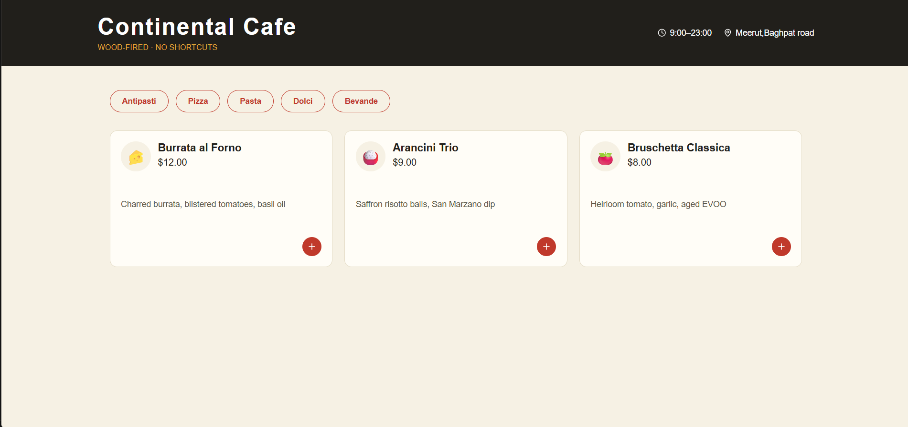

# 🍕 Continental Cafe - Food Delivery App

A modern and responsive food delivery frontend application built using React.js. 
Continental Cafe is designed for food lovers to explore different food categories, add items to their cart, and place orders through a simple and intuitive interface.

---

## 🚀 Live Demo

🔗 Coming Soon

---

## 📸 Project Preview

> Add your project screenshots here.



---

## ✨ Features

- 🍕 Browse food items by categories
- 🧀 Multiple food categories:
  - Antipasti
  - Pizza
  - Pasta
  - Dolci
  - Bevande
- 🛒 Add food items to cart
- ➕ Increase food quantity
- ➖ Decrease food quantity
- 💰 Dynamic cart management
- 📱 Responsive design for different screen sizes
- 🎨 Clean and modern user interface
- ⚡ Fast and smooth React-based frontend
- 🧩 Component-based architecture

---

## 🛠️ Tech Stack

### Frontend

- React.js
- JavaScript
- HTML5
- CSS3

### Libraries

- Lucide React
- React Context API

### Tools

- Vite
- Git
- GitHub
- VS Code

---

## 📂 Project Structure

```text
food-app/
│
├── public/
│
├── src/
│   │
│   ├── assets/
│   │
│   ├── components/
│   │   ├── FoodCard.jsx
│   │   ├── Navbar.jsx
│   │   └── footer.jsx
│   │
│   ├── contexts/
│   │   └── CartContext.jsx
│   │
│   ├── data/
│   │   └── menu.js
│   │
│   ├── pages/
│   │   ├── home.jsx
│   │   ├── menu.jsx
│   │   ├── cart.jsx
│   │   └── checkout.jsx
│   │
│   ├── App.jsx
│   ├── App.css
│   ├── index.css
│   └── main.jsx
│
├── package.json
├── package-lock.json
└── README.md
